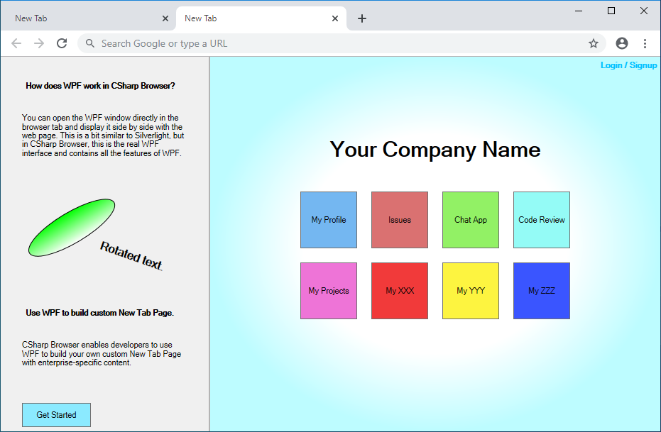

# CSharp Browser for WPF

CSharp Browser is a browser development framework based on the Chromium open source project. The goal of the project is to enable .NET developers to build their own browsers using Microsoft.NET desktop technology and build hybrid web pages based on Microsoft.NET and Web. CSharp Browser has two editions, one is open-source, another is commercial, detail information please visit our GitHub (https://github.com/TangramDev) and our website (https://www.tangram.dev).

## How does WPF work?

CSharp Browser enables developers to run WPF in a browser window, fill the whole window, or share it with a web page. Unlike Silverlight, in the CSharp browser, WPF is displayed directly in the browser window without recompilation. Besides being displayed in the browser, it is no different from the standard WPF. But its advantage is that WPF can communicate with the HTML page freely, and customers can open WPF applications through URL.

To experience the CSharp Browser, you first need to make sure your computer is WIndows 7, Windows 8.1 or Windows 10, and has .NET Framework 4 or later. Download and extract the preview package to any location and run the demo MyWpfBrowser1 to MyWpfBrowser3. If everything is OK, you will see the following pictures.



Customized New Tab Page using WPF.


Hosted WPF applications into a browser, it was similar to Silverlight.


Enable communication between WPF and webpages, developers can handle events in WPF use Javascript and vice versa.

## How to build your own browser?

You first need a computer with Windows 10 and Visual Studio 2019 installed. The following Visual Studio installation items are essential.

- .NET desktop development
- Desktop development with C++ (Required if  develop with C++)
  - Visual C++ MFC for x86 and x64
  - C++/CLI support

Also make sure you have the latest version of the Windows SDK installed.

Download [tangram_runtime_chromium_78_1.0.0.zip](https://github.com/TangramDev/tangram_runtime_binaries/releases/download/v1.0.0/tangram_runtime_chromium_78_1.0.0.zip) and extract it to the `C:\src`directory.


Create a WPF project (.NET Framework) using Visual Studio. And reference to `tangram_clr_rt.dll`(Located at `C:\src\tangram_runtime_chromium_78_1.0.0\`).


Change platform target to x64.


Update the Output path to `C:\src\tangram_runtime_chromium_78_1.0.0\`.


The WPF project does not explicitly include the `Main` function by default. Developers need to delete the `App.xaml` and the `App.xaml.cs` and add a `Program` class file similar to the following:

```c#
using System;
using System.Collections.Generic;
using System.Linq;
using System.Text;
using TangramCLR;

namespace MyWpfBrowser
{
    class Program
    {
        // All WPF applications should execute on a single-threaded apartment (STA) thread
        [STAThread]
        public static void Main()
        {
            WpfApplication app = new WpfApplication();
            app.Run();
        }
    }
}
```

Build and run the WPF program.


A Chromium window will open. Next, we add the following code to customize the New Tab Page.

```c#
WpfApplication app = new WpfApplication();
Tangram.UpdateNewTabPageLayout("Default_Wpf.xml"); // New line
app.Run();
```

UpdateNewTabPageLayout needs to pass in an XML file, similar to the following:

```xml
<?xml version="1.0" encoding="utf-8" ?>
<ntp>
  <window>
    <node id='splitter' name='splitter' rows='1' cols='2' height='250,' width='350,100,' borderwidth='0' splitterwidth='2' middlecolor='RGB(180,180,180)'>
      <node id="clrctrl" cnnid="MyWpfBrowser.UserControl1,host"></node>
      <node id="hostview"></node>
    </node>
  </window>
</ntp>
```

Save the XML as a file named `Default_Wpf.xml` and copy it to the `C:\src\tangram_runtime_chromium_78_1.0.0\Default_Wpf.xml`, the `cnnid` requires a valid WPF UserControl, let's create a new one.


Build and run this WPF program again.


## Troubleshoots


If your browser looks like the picture above, add an app.manifest file to your project and uncomment the following lines, and rebuild.

```xml
<compatibility xmlns="urn:schemas-microsoft-com:compatibility.v1">
    <application>
        <!-- A list of the Windows versions that this application has been tested on
           and is designed to work with. Uncomment the appropriate elements
           and Windows will automatically select the most compatible environment. -->

        <!-- Windows Vista -->
        <supportedOS Id="{e2011457-1546-43c5-a5fe-008deee3d3f0}" />

        <!-- Windows 7 -->
        <supportedOS Id="{35138b9a-5d96-4fbd-8e2d-a2440225f93a}" />

        <!-- Windows 8 -->
        <supportedOS Id="{4a2f28e3-53b9-4441-ba9c-d69d4a4a6e38}" />

        <!-- Windows 8.1 -->
        <supportedOS Id="{1f676c76-80e1-4239-95bb-83d0f6d0da78}" />

        <!-- Windows 10 -->
        <supportedOS Id="{8e0f7a12-bfb3-4fe8-b9a5-48fd50a15a9a}" />

    </application>
</compatibility>
```

